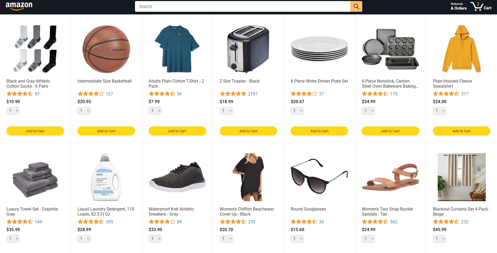
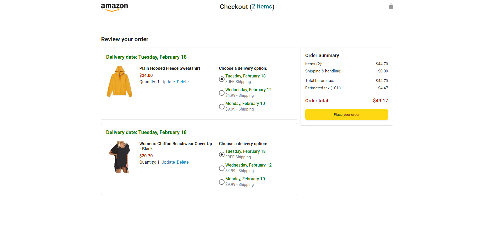

# Simple Amazon Clone

This project is a simple clone of Amazon's main page and shopping cart, created using **HTML** and **JavaScript**. It was built as part of a course to practice web development basics, focusing on replicating the layout and design of Amazon's website, with minimal JavaScript functionality for the shopping cart. 

### 1. Main Page
The main page replicates the look and feel of Amazon's homepage.

### 2. Shopping Cart
The shopping cart page allows users to:
- Add items to the cart by clicking on the "Add to Cart" button.
- View items added to the cart, including product name, image, price, and quantity.
- Display the total cost of items in the cart.
- Simple cart interactivity using **JavaScript** to update the cart dynamically.

  
## Technologies Used
- **HTML** – for structuring the pages.
- **CSS** – for styling and layout design.
- **JavaScript** – for implementing cart interactivity and dynamic updates.

## Screenshots

